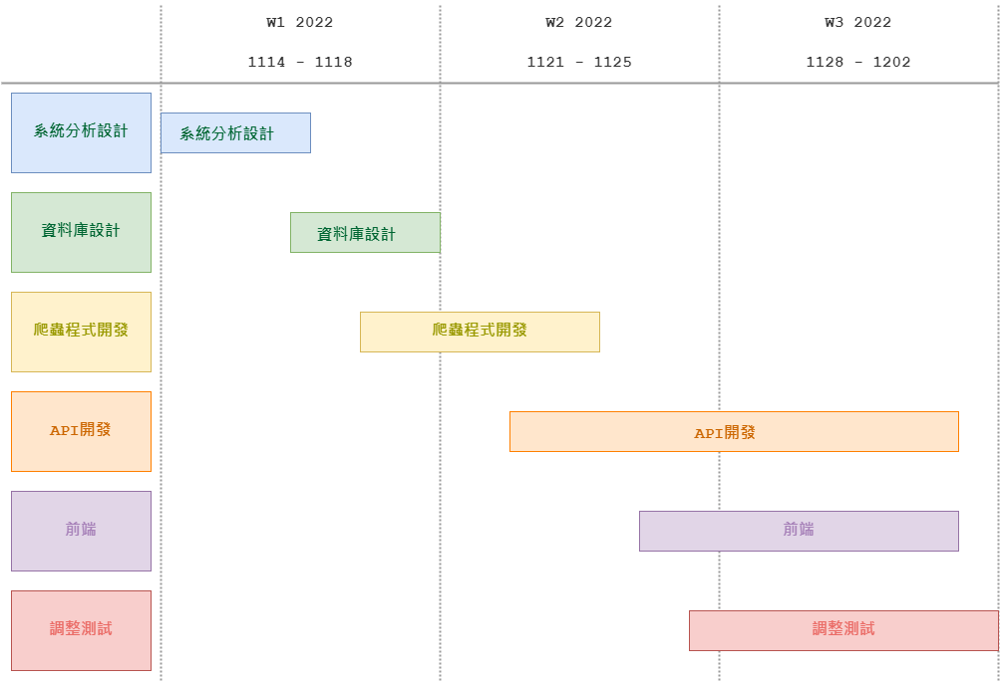
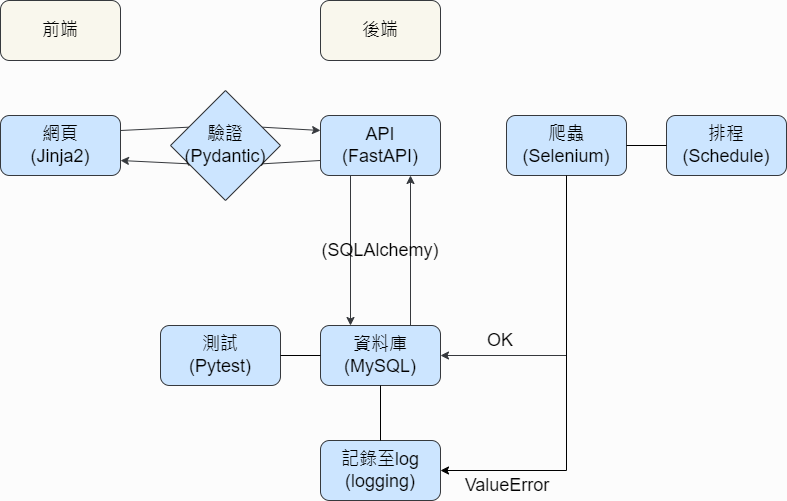
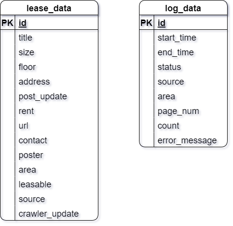

## 一、時程規劃


## 二、專案架構


## 三、資料格式


## 四、部屬及執行
### (一) Docker 建立容器
```shell
docker run --name mysql-db -p 3306:3306 -d mysql -e MYSQL_ROOT_PASSWORD=<password>
```

### (二) 建立 .env
- 在`sql_app`目錄下建立`.env`檔案，設定以下內容，指定本機資料庫連線路徑。   
```shell
engine_url = mysql+pymysql://<username>:<password>@<host>:<port>/<database_name>
```

### (三) 安裝套件
於 yutang-web-crawler 目錄下執行以下指令，安裝 poetry.lock 內記載的套件
```shell
poetry install
```
### (四)  初始化資料庫

```shell
sql_app/main.py
```

### (五) 啟動爬蟲排程
排程設定爬蟲每小時運行一次
```shell
cli.py
```
執行參數`-s`可指定開始執行時間(分鐘)  
例：輸入30，則爬蟲會於10:30、11:30、12:30......開始運行

### (六) 啟動API
```shell
api/main.py
``` 
使用瀏覽器開啟OpenAPI文檔
```shell
http://127.0.0.1:8080/docs
``` 