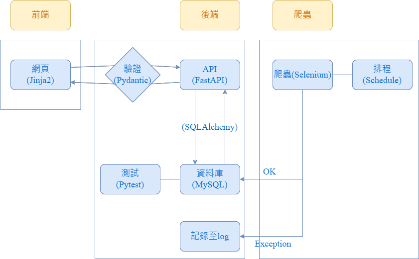

## 專案架構

## 資料格式

## 如何部屬及執行
### 初始化資料庫
本專案資料庫使用MySQL。  
- 在`sql_app`目錄下建立`.env`檔案，設定`engine_url = your_url`指定本機資料庫連線路徑。  
- 運行`sql_app/main.py`，即可初始化資料庫。

### 啟動爬蟲排程
排程設定爬蟲每小時運行。
- 運行`cli.py`  
- 輸入執行參數`-s`可指定開始執行時間(分鐘)  
例：輸入30，則爬蟲會於10:30、11:30、12:30......開始運行

### 啟動API
本專案使用FastAPI
- 運行`api/main.py`  